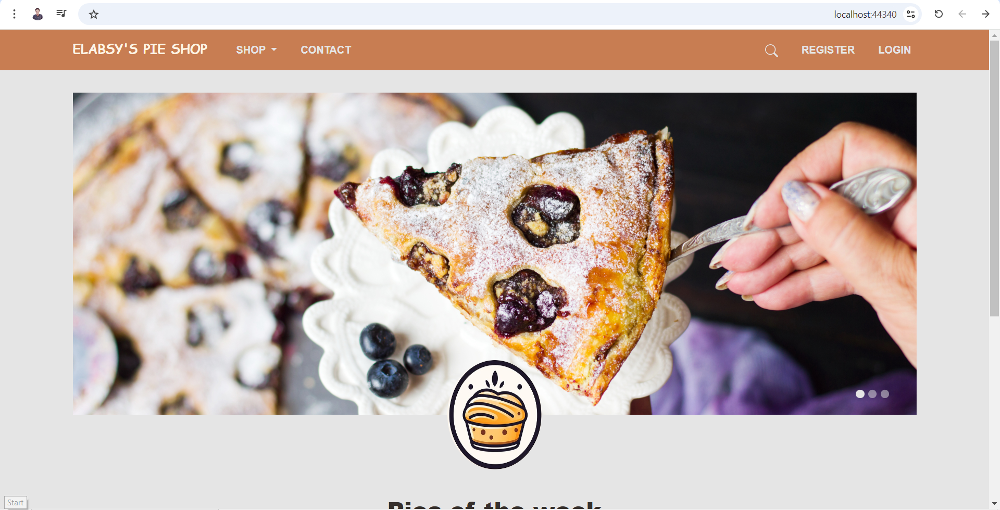
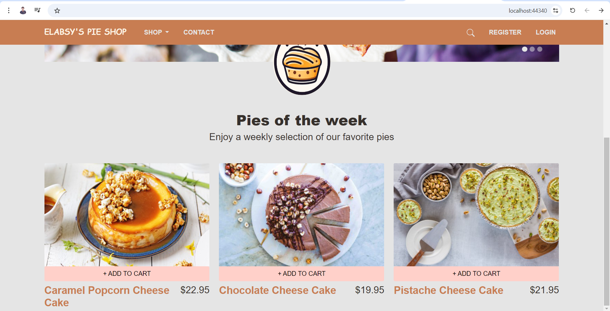
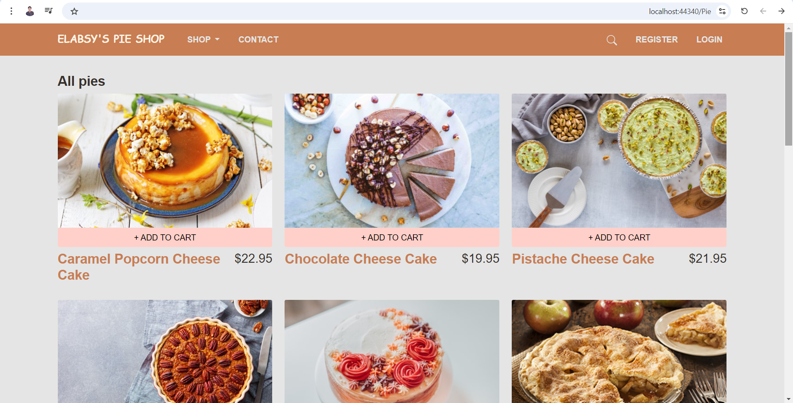
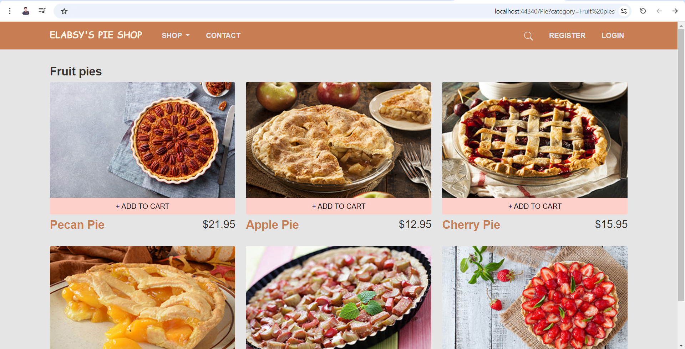
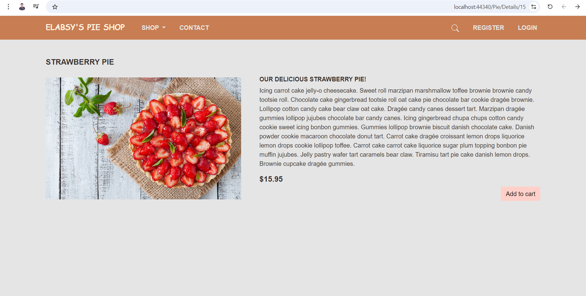
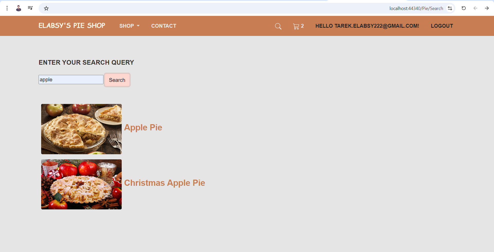
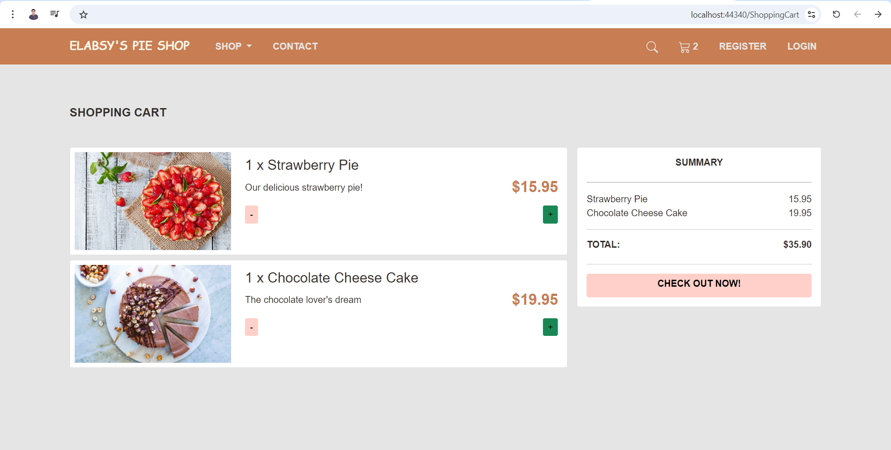
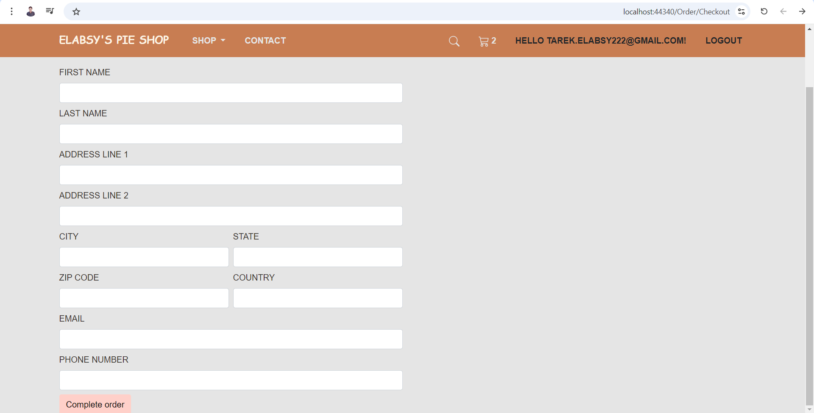
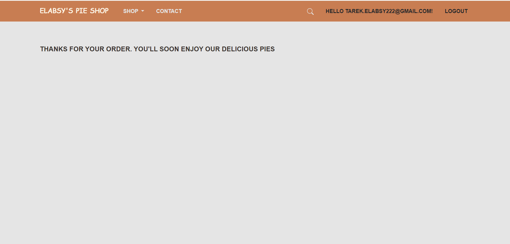
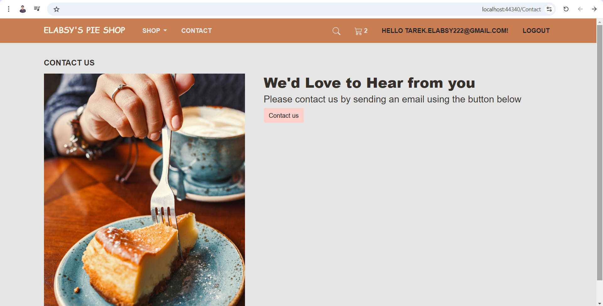

# Pie Shop Ecommerce

**Elabsy's Pie Shop Ecommerce** is a full-featured web application for an online store specializing in various types of pies. This project offers a user-friendly interface for browsing, selecting, and purchasing pies, built with modern technologies to ensure a high-quality experience.

## Features

- **Attractive and Responsive Design:** User interface adapts to all devices and screen sizes.
- **Product Catalog:** Display pie details, including images, descriptions, and prices.
- **Shopping Cart:** Add items to the cart, modify quantities, and view cart contents.
- **Secure Checkout:** Support for multiple payment methods with secure transactions.
- **User Accounts:** User registration, login, and order history.

## Technologies Used

- **Frontend:** HTML, CSS, JavaScript, React
- **Backend:** C#, ASP.NET Core, Entity Framework
- **Database:** SQL Server
- **Version Control:** Git

## Screenshot 

## Contact

For any inquiries or questions, please  connect with me on [LinkedIn](https://www.linkedin.com/in/tarek-elabsy222).

Feel free to adjust the placeholders and details as needed. If there's anything more you'd like to add or modify, let me know!
